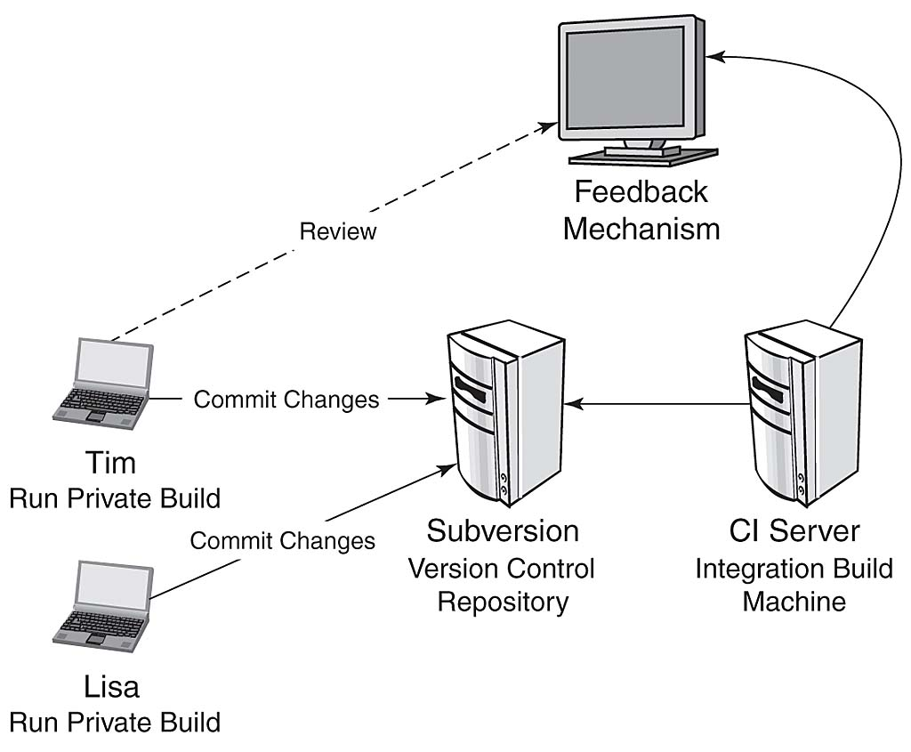

!SLIDE bullets

# Continuous Integration with  #

## An extendable open source continuous integration server ##

!SLIDE bullets incremental transition=fade

# Continuous Integration (CI) #

* [http://martinfowler.com/articles/continuousIntegration.html](http://martinfowler.com/articles/continuousIntegration.html)
* Improve quality, Decrease delivery time
* Integrate and test code changes early and often
* Make results visible to all
* Automate the Build and Deployment

!SLIDE bullets incremental transition=fade

# Workflow #

* Checkout code from SCM (SVN, GIT, etc)
* Make changes to code (bug fixes, new features)
* Write and Run automated tests
* Merge with latest changes from SCM
* Commit code
* Run a build on a clean machine (CI Server)

!SLIDE bullets incremental transition=fade

!SLIDE bullets incremental transition=fade

# Introducing Jenkins #

* Open Source Continuous Integration Server
* [http://jenkins-ci.org](http://jenkins-ci.org)
* Formerly known as Hudson (Oracle owns the rights) 
* Collaborate on GitHub: [https://github.com/jenkinsci](https://github.com/jenkinsci)

!SLIDE bullets incremental transition=fade

# Installation #

* Native packages are available for many platforms.

* wget http://mirrors.jenkins-ci.org/war/latest/jenkins.war
* java -jar jenkins.war
* Visit http://server:8080
* /Users/jheth/.jenkins

!SLIDE bullets smaller incremental transition=fade

# Architecture #

* Jenkins Core
* 300+ community contributed plugins
* ~  Artifact Uploaders
* ~  Authentication and User Management
* ~  Build Notifiers
* ~  Build Reports
* ~  Build Triggers
* ~  Cluster Management
* ~  Source Code Management
* ~  User Interface

!SLIDE bullets incremental transition=fade

# Install Plug-In #

* Manage Jenkins -> Manage Plugins
* Check the box
* Click Install
* Restart Jenkins

!SLIDE bullets smaller incremental transition=fade

# The Build #

### The entire set of ALL steps needed to obtain the software product. ###

* Checkout code from SCM
* Compile code (if necessary)
* Perform static analysis checks (PMD, CPD, Checkstyle)
* Run automated tests (xUnit)
* Generate code coverage reports
* Generate code documentation
* Display the results (Reports, Graphs)
* Publish/Deploy build artifacts (FTP, SCP)
* Alert developers on failure (Email, Jabber)

!SLIDE bullets incremental transition=fade

# Demo #

